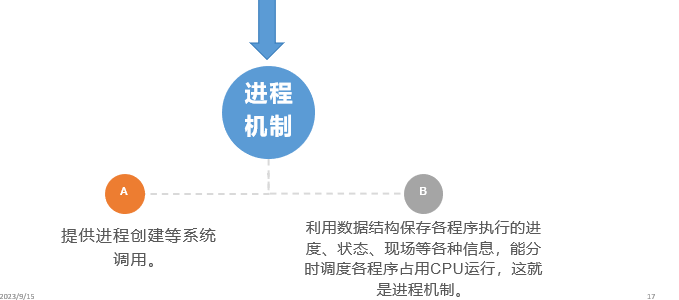
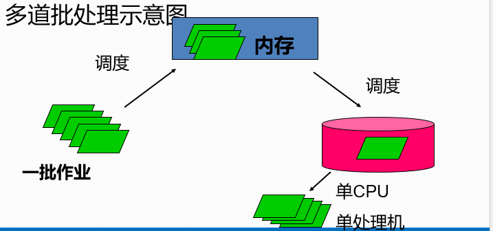
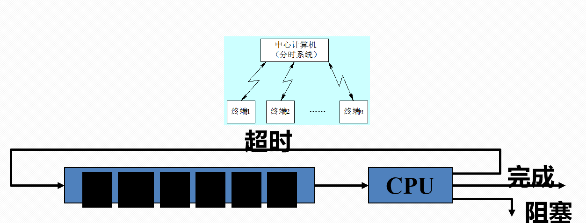

## 操作系统概述

硬件资源共享使用的方法有两种:

+ ==空分==针对**存储资源**而言**。存储资源的空间可以被多个用户（程序）以==分割==的方式占用。**
+ ==时分==

#### 操作系统为程序提供运行机制

​	如何保证**并发过程中**各程序执行的==进度==,状态,现场等各种信息

## 发展过程

### ==单处理机==单道批处理系统

Monitor——为了摆脱人工干预，人们把常驻内存的程序负责计算机的I/O入、运行控制、出错处理的程序称为**监督程序**。**计算机能够自动地成批地处理一个或多个用户的作业。**

1. **单处理机:** 一个`cpu`,意味着单处理机系统在某一个时刻只能处理一个作业
2. **单道:** 系统一次只让一个作业程序进入系统内存
3. **作业:** 一次上机活动中需要计算机系统所做的一些列工作集合
4. 批处理: 将多个作业组合成一批进行处理,成批的处理,成批的退出

> ==作业是成批处理的,但在内存中始终保持一道作业.==      ---单道批处理

**特点**

+ ==自动性==
+ ==顺序性==
+ ==单道性==

### ==单处理机==多道批处理系统

+ **并发：**两个或多个事件在同一时间间隔内发生。

+ **并行：**两个或多个事件在同一时刻发生

+ **多道：**内存中可以同时存放多个作业，多个作业==交替==使用CPU和系统中的各种资源。

> **原理：**作业成批的输入系统并暂存在外存中， 组成后备队列，系统按一定的调度原则从后备队列中选择一个或者多个作业入内存进行处理。当一批作业运行完，系统便接受下一批作业。

> ==宏观上并行,微观上串行==

### 分时系统(Time-Sharing)

==分时==:指将处理机（CPU）的运行时间分成很短的时间片，每个作业每次只能运行一个时间片。

**如果某作业在一个时间片用完时仍未完成？**

则该作业就暂时中断，放入队列末等待下一轮运行，并把处理机的控制权让给另一个作业使用。

#### 分时系统的特征

+ ==多路性==: 多个用户同时工作。共享系统资源，提高了资源利用率。
+ ==及时性==：用户能在很短时间内得到系统响应
+ ==独立性==：各用户独立操作，互不干扰。
+ ==交互性==：系统能及时对用户的操作进行响应，加快调试过程，缩短了周转时间。

### 实时系统(`Real－time`)

==实时系统:及时==，实时系统必须具有在一个事先定义好的时间限制内，对外部或内部的事件进行响应和处理的能力,并控制所有实时任务协调一致地运行,其中包括**硬件实时系统**和**软件实时系统**

==适用领域==：用于过程控制、军事实时控制、事务处理系统（金融）等领域。	

+ **特点**
  + 及时性:任务有明确和固定的时间约束，在一定范围之内必须作出响应；否则任务就会失败，有可能造成灾难性后果。
  + 系统可靠性高
  

### 网络操作系统（)

## 中断和异常

+ 中断： 也称**外中断**，指来自cpu执行指令以外的事件发生
  + `I/O结束中断`
  + 时钟中断
+ 异常：也称`内中断、列外、自陷(Trap)`:指cpu执行指令内部的事件 – 当前执行的指令发生错误了
  + 非法操作码
  + 地址越界
  + 算术溢出
  + 虚存系统的缺页及专门的自陷指令

异常不能被屏蔽，一但出现应立即处理

**中断处理过程**

1. 关中断
2. 保存断点
3. 引出中断服务程序
4. 保存现场和屏蔽字
5. 开中断
6. 执行中断处理程序
7. 关中断
8. 恢复现场
9. 开中断

## 进程与处理机管理

> 	进程 = 程序段 +  数据 + PCB(进程控制块)

+ 程序段: 描述进程所要完成的功能
+ 数据:进程在执行时必不可少的工作区和操作对象
+ PCB:为了方便操作系统对进程的管理和控制,操作系统必须为每个进程建立一个进程控制块用以描述进程的控制和管理信息.

### 进程管理中的数据结构

+ 进程标识符信息
	+ 外部标识符：创建者提供，便于记忆的，比如进程名，通常基于可执行名，不唯一
	+ 内部标识符：系统为每一个进程赋予的唯一整数
+ 处理器状态信息：
+ 进程调度信息  
+ 进程控制信息
进程控制块`PCB`的组织方式

> 一个系统中，通常拥有很多个PCB，常用的组织方法有三个
1. 先行方式
2. 链接方式
3. 索引方式

### 进程控制
> 操作系统的两大功能

1. 支撑功能
	+ 中断处理
	+ 时钟管理
	+ 原语操作
2. 资源管理功能
	+ 进程管理
	+ 存储器管理
	+ 设备管理

进程控制的概念
+ 进程控制通过执行各种原语来实现

