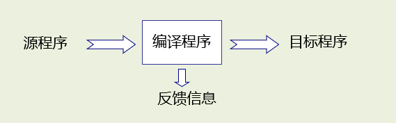
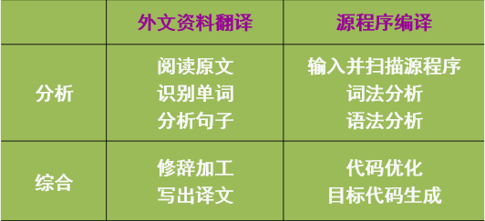

# 编译原理

## 第一章 引论

### 什么是编译程序

#### 编译系统崽计算机系统中的地位

+ **系统软件**: 和具体的应用领域无关，如语言处理系统和操作系统等，应用软件一般都通过系统软件发挥作用
+ **应用软件**: 和具体的应用领域相关，如文档处理软件和各类娱乐软件等
+ **语言处理系统**: 把程序设计语言书写的各种程序处理成可在计算机上执行的程序，==编译系统==

编译程序是现代计算机系统的基本组成部分,属于==系统软件==

#### 编译程序的功能

+ 从功能上来看，编译程序是一种语言翻译程序 **(`Translator`)**

  + 将用`源语言`编写的程序翻译为用`目标语言`表示的程序

  

#### 编译程序的基本任务

+ ==编译程序的基本任务是将源程序翻译成等价的目标程序语言==
  + 需要对源程序进行**分析** (`Analysis`) ，识别源程序的语法结构信息，理解源程序的语义信息， 反馈相应的出错信息
  + 根据分析结果及目标信息进行**综合** (`Synthesis`) ，生成语义上等价于源程序的目标程序

### 编译过程和编译程序的结构

外文翻译与源程序编译的类比

## 第二章文法和语言

	### 符号和符号串

####  符号和符号串的概念

##### 符号相关定义

+ 语言:可以看成在一个基本符号集上定义的,按一定规则构成的
+ 切基本符号串组成的集合
+  字母表 ( 符号集 Σ ) :是一个非空有穷集合
+  符号 ( 字符 ) :字母表中的元素
+  符号串:符号的有穷序列 ( 注意:  表示空符号串,表示什么符
  号也不含的符号串 )

##### 符号集合

+  字母表上若干个符号串组成的集合
+ 空集:不含任何元素的集合,记为 Ø
+ 

### 文法和语言的形式定义

